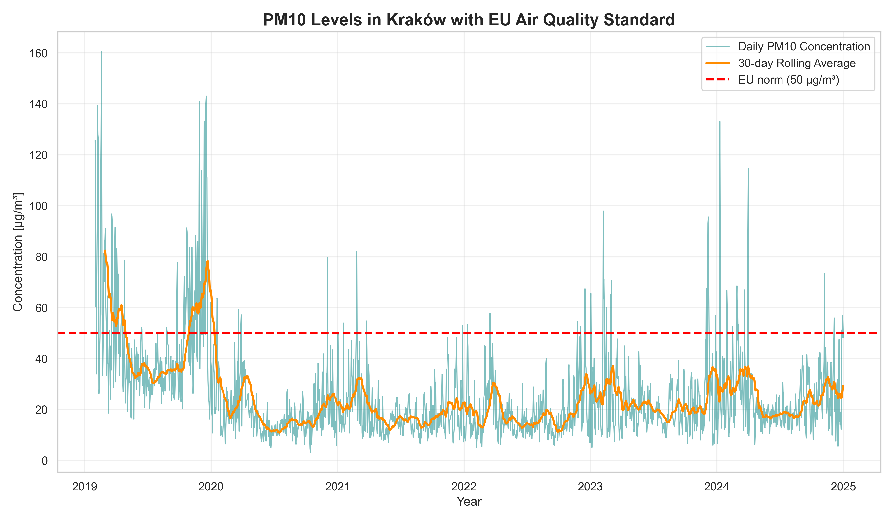
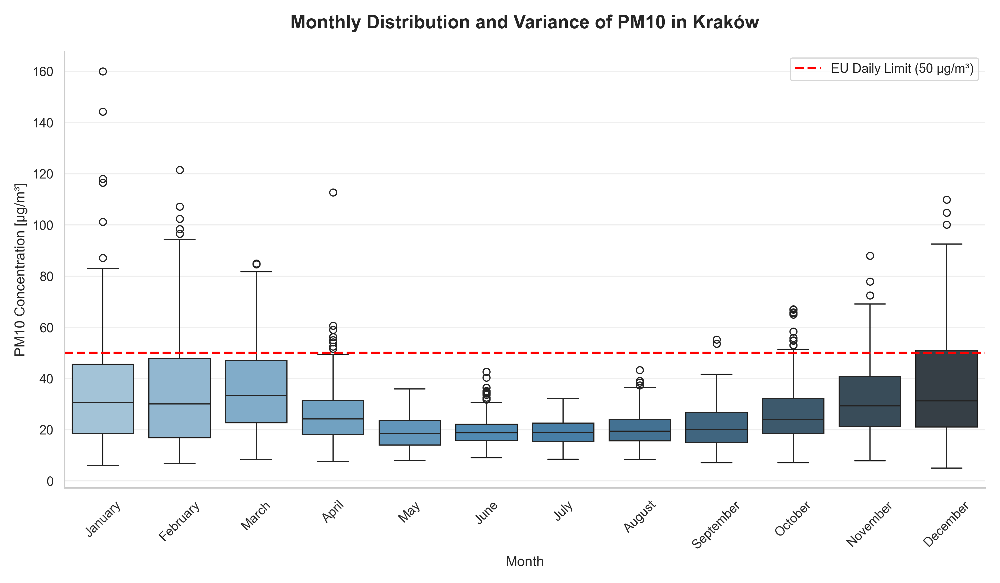
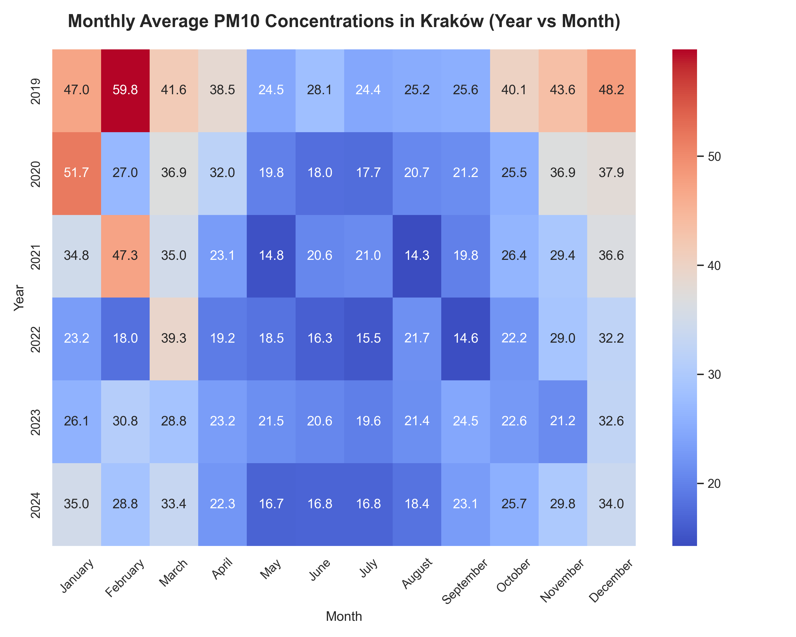

# AirPulse Kraków - Smart Air Quality Forecasting System

**End-to-end machine learning system for daily PM10 concentration forecasting across seven monitoring stations in Kraków.**  
Covers data engineering, exploratory analysis, multi-model forecasting (LightGBM, SARIMAX, Prophet, ARIMA), a REST API, and an interactive web dashboard - all containerised with Docker.

---

## Table of Contents

1. [Project Overview](#1-project-overview)
2. [Project Architecture](#2-project-architecture)
3. [Data Loading](#3-data-loading)
4. [Data Preprocessing](#4-data-preprocessing)
5. [Exploratory Data Analysis](#5-exploratory-data-analysis)
6. [Feature Engineering](#6-feature-engineering)
7. [Modeling](#7-modeling)
8. [Evaluation](#8-evaluation)
9. [Advanced Analysis](#9-advanced-analysis)
10. [Streamlit Application](#10-streamlit-application)
11. [FastAPI Backend](#11-fastapi-backend)
12. [Docker Setup](#12-docker-setup)
13. [Business Insights](#13-business-insights)
14. [Conclusion](#14-conclusion)
15. [How to Run](#15-how-to-run)

---

## 🚀 Live Demo

| Platform | Link | Description |
| :--- | :--- | :--- |
| **Streamlit App** | [](https://airpulse-krakow-smart-air-quality-forecasting-system-hnsfun9ue.streamlit.app) | Interactive dashboard and models explanations |

---

## 1. Project Overview

Kraków ranks among the most polluted cities in Europe during winter months. PM10 - particulate matter with a diameter of 10 micrometres or less - poses serious health risks, particularly for people with respiratory and cardiovascular conditions. Daily 24-hour average concentrations frequently exceed the EU regulatory limit of **50 µg/m³**, triggering public-health advisories and transport restrictions.

This project builds a **production-ready forecasting system** that predicts next-day (and multi-day) PM10 concentrations across **all active Kraków GIOŚ monitoring stations**, with `MpKrakWadow` (Wadowicka) as the primary training target.

**System summary:**

| Layer | Technology |
|---|---|
| ML pipeline | Modular `src/` package + CLI (`main.py`, `scripts/prepare_api_artifacts.py`) |
| Models | LightGBM, SARIMAX, Prophet, ARIMA |
| Explainability | SHAP (SHapley Additive exPlanations) |
| REST API | FastAPI + Uvicorn |
| Dashboard | Streamlit ("AirPulse Kraków") |
| Containerisation | Docker + Docker Compose |
| Testing | pytest (unit tests for preprocessing, feature engineering, utils) |

---

## 2. Project Architecture

```
.
├── src/                             # Modular ML pipeline
│   ├── data_loading.py              # PM10 Excel ingestion + Open-Meteo weather fetch
│   ├── data_preprocessing.py        # Gap imputation (short-gap interp, long-gap NaN + flag)
│   ├── feature_engineering.py       # Full feature pipeline (Box-Cox, lags, rolling, etc.)
│   ├── models.py                    # ARIMA, SARIMAX, Prophet, LightGBM training
│   ├── evaluation.py                # Metrics, plots, exceedance analysis
│   ├── eda.py                       # EDA plots
│   ├── config.py                    # Training constants (stations, dates, hyperparams)
│   └── utils.py                     # Logger, Box-Cox inverse, plot helpers
├── backend/
│   ├── api.py                       # FastAPI app (predict / explain / interpret / metrics / stations)
│   ├── schemas.py                   # Pydantic v2 request/response models
│   └── services/
│       ├── model_service.py         # Model loading, prediction, regime classification
│       ├── explainability_service.py# SHAP computation
│       └── interpretability_service.py # Rule-based NLG forecast explanations
├── frontend/
│   └── app.py                       # Streamlit dashboard ("AirPulse Kraków")
├── config/
│   └── config.py                    # Shared runtime config (API host, stations, thresholds, colours)
├── scripts/
│   └── prepare_api_artifacts.py     # End-to-end: train all models + serialise every artefact
├── tests/                           # pytest suite (feature-engineering, preprocessing, utils, …)
├── models/                          # Serialised artefacts (*.pkl, *.joblib) – produced by the script
├── data/                            # Raw yearly PM10 Excel files (2019–2024) – not in git
├── images/                          # Generated plots
├── docker-compose.yml
├── requirements.txt
└── main.py                          # CLI entry-point for the training + evaluation pipeline
```

### Component interaction

```
┌───────────────────────┐    HTTP     ┌───────────────────────┐
│   Streamlit Frontend  │ ──────────► │   FastAPI Backend     │
│   (port 8501)         │ ◄────────── │   (port 8000)         │
└───────────────────────┘             └──────────┬────────────┘
                                                 │ loads at startup
                                      ┌──────────▼────────────┐
                                      │  models/*.pkl/.joblib │
                                      │  (LightGBM, ARIMA,    │
                                      │   SARIMAX, KMeans,    │
                                      │   scaler, λ_bc,       │
                                      │   recent_history)     │
                                      └───────────────────────┘
```

The **Streamlit frontend** collects a monitoring station selection, model choice, and forecast date from the user, forwards them to the **FastAPI backend**, and renders the returned forecasts, confidence intervals, SHAP contributions, and AI-generated narrative. All trained models are serialised as `.pkl` / `.joblib` artefacts and loaded into memory once at API startup. The `src/` modules contain the same logic as the notebook and are used by both `scripts/prepare_api_artifacts.py` and the backend services.

---

## 3. Data Loading

### Sources

| Source | Format | Coverage |
|---|---|---|
| GIOŚ (Polish Chief Inspectorate for Environmental Protection) | Excel (`.xlsx`) | 2019–2024, daily 24-hour PM10 averages |
| Open-Meteo Archive API | JSON via HTTP | Daily weather for Kraków (2019–2024) |

### PM10 data

The GIOŚ export format places the header row (`Kod stacji`) at a variable row position depending on the year. The loader scans each file dynamically to find this row before re-reading with the correct `header` argument:

```python
load_pm10_raw(data_dir, years=range(2019, 2025))
```

Station codes are **detected automatically** from the Excel files at runtime - the system reads only the first 5 rows of each workbook (fast), then scans for column names starting with `MpKrak*`. This means newly added GIOŚ stations are picked up without code changes.

All seven currently known Kraków monitoring stations:

| Code | Location |
|---|---|
| `MpKrakWadow` | Wadowicka (primary training target) |
| `MpKrakAlKras` | Al. Krasińskiego |
| `MpKrakBujaka` | Bujaka |
| `MpKrakBulwar` | Bulwarowa |
| `MpKrakOsPias` | Os. Piastów |
| `MpKrakSwoszo` | Swoszowice |
| `MpKrakZloRog` | Złoty Róg |

Decimal separators in the GIOŚ export use commas (Polish locale); these are normalised to dots during parsing. A strict daily `DatetimeIndex` is enforced via `asfreq('D')`, inserting `NaN` for any missing dates.

### Weather data

Daily meteorological variables are fetched from the **Open-Meteo** archive endpoint for the city-centre coordinates (shared across all stations):

- Temperature (avg, min, max)
- Precipitation (rain sum, snowfall sum)
- Wind (mean speed, max gust, dominant direction)
- Relative humidity (avg)
- Surface pressure (avg)

Dominant wind direction is encoded as **sin/cos cyclical features** immediately after download to preserve the circular topology (i.e., NW and N are close; N and S are far).

---

## 4. Data Preprocessing

Raw sensor data and meteorological records from multiple sources inevitably contain inconsistencies, gaps, and formatting artefacts. This section transforms six annual GIOŚ Excel exports and the Open-Meteo weather archive into a single, clean, analysis-ready daily DataFrame. Careful handling of missing values at this stage is essential to prevent silent misalignment of lag features and to ensure that the downstream models operate on a reliable temporal index.

### Steps and rationale

| Step | What it does | Why it's needed |
|---|---|---|
| Header detection | Locates `Kod stacji` row dynamically | GIOŚ format varies by year |
| Datetime conversion | `pd.to_datetime` with `errors='coerce'` | Non-date rows (metadata) become `NaT` and are dropped |
| `asfreq('D')` | Enforces strict daily frequency | Gaps would silently misalign lag features |
| Short-gap interpolation | Time-based linear interpolation for gaps ≤ 3 days | Sensor outages of 1–3 days are common and interpolation is reliable |
| Long-gap flagging | Binary `{station}_long_gap` column for gaps > 3 days | Avoids artificially constructing data where readings are genuinely absent |
| Boundary fill | `ffill()` / `bfill()` | Closes isolated NaNs at the start or end of the series after interpolation |
| Weather merge | Left join PM10 DataFrame on date index | Attaches meteorological context to each observation |

Short gaps are interpolated on a **time axis** (not row index) to respect the irregular distribution of readings. Long gaps are preserved as `NaN` with a companion indicator feature so the model can learn that the context is unreliable.

---

## 5. Exploratory Data Analysis

Before building any models, it is crucial to understand the structure, distribution, and seasonal behaviour of the PM10 signal and its relationship with meteorological drivers. This section visualises temporal patterns, identifies recurring seasonality, quantifies inter-annual variation, and decomposes the series into trend, seasonal, and residual components - findings that directly inform the choice of features and modelling approaches in subsequent stages.

### Time series overview



The raw PM10 series for `MpKrakWadow` (2019–2024) reveals a strong annual seasonality with pronounced **winter spikes** driven by residential coal and biomass combustion. 

Clean summer periods with concentrations below 20 µg/m³ contrast sharply with heating-season episodes exceeding 120 µg/m³. The COVID-19 lockdowns in early 2020 produced a brief but notable reduction in baseline levels, visible as a slightly cleaner January–March window compared to surrounding years. The 50 µg/m³ EU daily limit is overlaid as a reference line, making it immediately apparent how frequently the threshold is crossed during the heating season. 

Year-over-year differences are clearly visible: 2022 stands out as a relatively clean winter, while 2023–2024 saw a modest uptick that may reflect changing weather patterns or partial reversal of emission reductions. 

The series exhibits marked heteroscedasticity — residual volatility is substantially higher in cold months — which directly motivates the Box-Cox variance-stabilising transformation applied later in the pipeline.

---

### Monthly distribution



Boxplots by calendar month confirm that median PM10 is approximately **3–5× higher in winter (December–February) than in summer (June–August)**. 

The interquartile range also widens considerably in winter, reflecting greater day-to-day variability driven by weather conditions such as wind speed, temperature inversions, and precipitation. The EU daily limit of 50 µg/m³ is routinely breached from October through March, with December and January showing the highest median values and the widest spread. 

Summer months (June–August) display a narrow, low distribution with medians below 20 µg/m³ and few outliers, confirming that forecasting difficulty is concentrated in the heating season. Spring and autumn (March–April, September–October) act as transitional periods, with moderate interquartile ranges that reflect the uncertain onset and retreat of residential heating. 

The extreme outliers visible in January and December correspond to severe smog episodes where PM10 exceeds 120–130 µg/m³ — events that pose acute health hazards and typically trigger public transport-free days and outdoor-activity advisories in Kraków.

---

### Year × Month heatmap



The heatmap of mean monthly PM10 by year reveals that **2020 and 2022 had notably cleaner winters**, while **2023 and early 2024 saw elevated concentrations**. 

Year-over-year variation is substantial, reflecting both meteorological differences and gradual policy changes (e.g., the Małopolska anti-smog resolution restricting solid-fuel heating). The colour scale transitions from deep blue (clean) to dark red (heavily polluted), making seasonal and inter-annual patterns immediately legible without requiring numerical labels. 

A consistent band of elevated values runs across the winter columns (November–February) for every year, confirming the dominance of the heating season as the primary pollution driver. The 2020 anomaly — a relatively cooler colour in January–February — aligns with a milder-than-average meteorological winter combined with early pandemic movement restrictions. Summer months form a uniformly cool horizontal band at the bottom of each column, reinforcing the finding that solar radiation, longer days, and higher wind speeds create effective natural pollutant dispersion. 

The heatmap serves as a compact diagnostic tool for tracking the long-term impact of anti-smog regulation: a gradual cooling of winter colours after 2022 is tentatively visible, suggesting the ordinance is having a measurable effect on baseline PM10 levels.

---

### STL decomposition


STL (Seasonal-Trend decomposition using LOESS) separates the signal into trend, seasonal, and residual components, providing a cleaner view of each structural element than classical additive decomposition. 

The seasonal component confirms a dominant annual cycle with a peak-to-trough amplitude of roughly 40 µg/m³, consistent with the shift from heating to non-heating periods. The trend component reveals a subtle downward drift after 2022, tentatively linked to the progressive enforcement of the Małopolska anti-smog ordinance banning high-emission solid-fuel boilers. 

The residuals exhibit clear heteroscedasticity — variance is noticeably higher in winter — which directly motivates the **Box-Cox transformation** applied in the feature engineering pipeline to stabilise variance before modelling. Unlike classical decompositions, STL is robust to outliers because LOESS fitting uses locally weighted regression, preventing extreme smog-episode days from distorting the estimated seasonal shape. The LOESS bandwidth parameters were tuned to capture the annual cycle without over-smoothing multi-week heating episodes. 

Understanding the relative magnitude of trend, seasonal, and residual components guides model design: the strong seasonal component is addressed via calendar and lag features, while the residuals justify the inclusion of daily weather covariates to explain unexplained day-to-day variation.

---

## 6. Feature Engineering

Raw temporal and meteorological signals carry limited predictive value on their own. This section transforms them into a rich set of model-ready predictors grounded in domain knowledge of urban air quality dynamics - encoding the heating-season effect, atmospheric dispersion physics, and spatial coherence across stations into explicit numeric features. The engineered features are designed to benefit the **LightGBM** model directly, and also serve as exogenous regressors for **SARIMAX** and **Prophet**.

The full feature pipeline is implemented in `src/feature_engineering.py` and runs in a fixed order to prevent data leakage.

### Feature groups

**Calendar features**
- `month`, `year`, `season`, `is_weekend`, `is_holiday` (Polish public holidays)
- Cyclical encoding: `month_sin/cos`, `doy_sin/cos`, `dow_sin/cos` - removes artificial discontinuities at year/week boundaries

**Box-Cox transformation**
- Lambda (λ) is estimated exclusively on training data, then applied to the full series
- Stabilises variance and normalises the heavy right tail of PM10, which improves both tree-based and statistical model performance

**Lag features** (computed on the Box-Cox-transformed target)
- `lag_1d`, `lag_2d`, `lag_7d`, `lag_14d`
- Yesterday's PM10 is the single strongest predictor; weekly lags capture the seasonal autocorrelation structure

**Rolling statistics** (computed on raw PM10 with `shift(1)` to prevent leakage)
- `rolling_mean_{3,7,14,30}d`, `rolling_std_{7,14}d`
- `rolling_diff_7d` (7-day minus 14-day mean): captures whether pollution is accelerating or easing

**Weather-derived features**

| Feature | Description |
|---|---|
| `is_frost` | Temperature ≤ 0 °C - proxy for increased heating demand |
| `is_calm_wind` | Wind mean ≤ 2 m/s - weak dispersion of pollutants |
| `wind_inverse` | 1 / (wind_max + 0.1) - non-linear dispersion proxy |
| `heating_degree_days` | max(0, 15 − temp_avg) - physical heating demand |
| `hdd_7d` | 7-day rolling HDD sum - accumulated thermal demand |
| `rain_yesterday`, `rain_3d_sum`, `rain_7d_sum` | Washout effects of recent precipitation |
| `dry_spell_days` | Days without rain in last 14 - particle accumulation |
| `inversion_proxy` | frost × calm × low temperature amplitude - detects inversions |

**Multi-station spatial features**
- Per-station `lag_1d` for all auxiliary stations (Swoszowice, Bujaka, Bulwarowa, and others detected in data)
- `aux_mean_lag1`, `aux_max_lag1`, `aux_spread_lag1`
- Inter-station Pearson correlations exceed 0.90; spatial aggregates provide a compact regional signal

**Interaction terms**
- `is_frost_calm`: frost × calm wind - double stagnation, highest smog risk
- `is_heating_season_calm`: heating season × calm - sustained elevated risk
- `hdd_calm`: heating demand × no wind - physically motivated
- `cold_dry_calm`: below-zero × no rain × calm - conditions for severe episodes

In total, over 40 features are passed to LightGBM, while a curated seven-variable subset is used as exogenous regressors in SARIMAX and Prophet.

---

## 7. Modeling

This section trains and compares four distinct forecasting approaches on the same chronological splits, ranging from a simple univariate statistical baseline to a high-dimensional gradient-boosted model. The goal is to evaluate the incremental value of adding weather covariates, seasonal decomposition, and non-linear feature interactions on PM10 prediction accuracy. All models are trained on the Box-Cox-transformed PM10 signal, and final performance metrics are computed on the original µg/m³ scale after inverse transformation.

### LightGBM (primary model)

A gradient-boosted decision tree model operating on the full 40+ engineered feature set.

- **Why:** Handles non-linear interactions, missing values, and heteroscedastic targets natively; fastest to train; supports SHAP
- **Training:** Optional 50-trial Optuna search over `learning_rate`, `num_leaves`, regularisation and bagging fractions; each trial is evaluated on a chronological 15% early-stopping holdout of the training set (`LGBM_ES_FRACTION = 0.15`); the final model is refit on the full training set with the best-trial `n_estimators` carried over; 3 000 estimators max; L1 (MAE) loss objective for robustness against outliers
- **Target:** Box-Cox-transformed PM10; predictions are back-transformed at evaluation time
- **Split:** Strict time-series split - no shuffling; train ≤ 2022-12-31, val = 2023

### SARIMAX (statistical baseline with weather)

Seasonal ARIMA with exogenous regressors and a weekly seasonality (`m=7`), with `order` and `seasonal_order` auto-selected by `pmdarima.auto_arima` at training time.

- **Why:** Interpretable; captures linear ARIMA dynamics explicitly; exogenous weather variables (`temp_avg`, `wind_max`, `is_heating_season`, `is_calm_wind`, `hdd_calm`, `rain_3d_sum`, `inversion_proxy`) are included as regressors
- **Training:** Walk-forward validation with full SARIMAX refit every `REFIT_EVERY = 7` steps; exogenous features are standardised with a `StandardScaler` fitted on the training set only (same scaler is persisted for the API)
- **Confidence intervals:** Available from the SARIMAX state-space covariance

### Prophet (additive decomposition model)

Meta's Prophet decomposes the time series into **trend + seasonality + holidays** and supports additional regressors.

- **Why:** Built-in yearly and weekly seasonality, Polish public holidays via `add_country_holidays('PL')`, and Fourier-based seasonal decomposition that smoothly captures recurring patterns with minimal hyperparameter tuning
- **Training:** Trained on Box-Cox-transformed PM10 for consistency with the target scale; seven meteorological regressors (same as SARIMAX) plus a 7-day rolling Box-Cox lag are included via `add_regressor()`; multiplicative seasonality mode; `changepoint_prior_scale=0.05`; Prophet's default `interval_width`
- **Strength:** Captures the broad seasonal arc smoothly; well-suited for trend and seasonality extraction
- **Limitation:** Produces smoother forecasts that are less reactive to day-to-day fluctuations compared to autoregressive models; tends to underestimate sudden meteorological-driven spikes

### ARIMA (pure time-series baseline)

A non-seasonal ARIMA fitted on the Box-Cox series; integration order `d` is chosen from the ADF stationarity test and the remaining `(p, q)` order is selected by `pmdarima.auto_arima`.

- **Why:** Serves as a reference point for how much is gained by adding weather covariates and richer features
- **Walk-forward:** Full refit every `REFIT_EVERY = 7` steps, with 90% prediction intervals

### Naïve persistence baseline

`PM10(t+1) = PM10(t)` - predicts tomorrow equals today. All models are benchmarked against this baseline; meaningful improvement over persistence is the minimum bar for a useful forecast.

---

## 8. Evaluation

This section assesses how well each of the four trained models generalises to the unseen 2023 validation set. Metrics are computed on **back-transformed µg/m³ values** to be directly interpretable. Beyond standard regression metrics, a binary exceedance classification view is applied to evaluate each model's ability to detect days that breach the EU 50 µg/m³ limit - the operationally most critical dimension for public-health applications.

### Regression metrics

| Metric | Formula | Purpose |
|---|---|---|
| **R²** | 1 − SS_res / SS_tot | Overall variance explained; 1 is perfect |
| **MAE** | mean(\|y − ŷ\|) | Average absolute error in µg/m³; robust to outliers |
| **RMSE** | √mean((y − ŷ)²) | Penalises large errors more heavily; sensitive to smog peaks |
| **SMAPE** | Symmetric Mean Absolute Percentage Error | Relative error measure; bounded [0, 200%], robust near zero |

### Validation set results (2023)

| Model | MAE (µg/m³) | RMSE (µg/m³) | SMAPE (%) | R² |
|---|---|---|---|---|
| **LightGBM** | **4.21** | **6.09** | **20.32** | **0.7250** |
| SARIMAX | 6.05 | 9.08 | 28.61 | 0.3889 |
| ARIMA | 6.24 | 9.39 | 30.85 | 0.3465 |
| Prophet | 6.90 | 9.68 | 36.17 | 0.3054 |

LightGBM achieves the lowest MAE and RMSE on the validation set, outperforming all statistical baselines by a wide margin (MAE roughly 30–40% lower than the next-best model). SARIMAX, which incorporates meteorological covariates, scores better than both the pure ARIMA baseline and Prophet. Prophet captures the broad seasonal arc but its smoother forecasts lead to higher errors on day-to-day fluctuations.

### Exceedance classification metrics

Since **health impact depends on whether the 50 µg/m³ EU limit is breached**, a binary classification view is computed alongside regression metrics:

| Metric | Purpose |
|---|---|
| **Precision** | Of all predicted exceedances, how many were real? |
| **Recall** | Of all real exceedances, how many were caught? |
| **F1** | Harmonic mean - balances false alarms and missed events |

For public-health use cases, **recall is prioritised**: missing a real smog day is more costly than a false alarm. The validation set contained **12 exceedance days** out of 365 (≈ 3.3% class imbalance).

| Model | Precision | Recall | F1 |
|---|---|---|---|
| **LightGBM** | **0.615** | **0.667** | **0.640** |
| SARIMAX | 0.600 | 0.250 | 0.353 |
| Naïve Persistence | 0.417 | 0.417 | 0.417 |
| Prophet | 0.250 | 0.083 | 0.125 |
| ARIMA | 0.000 | 0.000 | 0.000 |

LightGBM was the **only model to exceed the Naïve Persistence baseline** in exceedance detection, achieving a Recall of 0.67 and an F1-score of 0.64. ARIMA failed to predict any exceedance events. Prophet and SARIMAX detected some events but fell below the persistence benchmark.

### Model comparison


The model comparison bar chart presents the core regression metrics — MAE, RMSE, SMAPE, and R² — for all evaluated models on the 2023 validation set, displayed side by side for direct comparison. 

- LightGBM achieves the best result across every metric (MAE 4.21 µg/m³, RMSE 6.09 µg/m³, R² 0.73), outperforming the statistical baselines by approximately 30–40% on MAE. 

- SARIMAX, which incorporates exogenous weather variables, scores better than the pure ARIMA model, demonstrating the value of meteorological covariates even within a linear statistical framework. 

- Prophet achieves a slightly higher RMSE than SARIMAX due to its smoother, less day-to-day reactive forecasting style. 

The chart provides a regression-level sanity check: all four trained models produce useful forecasts, with LightGBM standing out as clearly superior.

---


The forecast comparison chart overlays actual PM10 observations (black line) with predictions from all models across the 2023 validation period, enabling a visual inspection of tracking quality that summary statistics alone cannot convey. 

- LightGBM follows the daily fluctuations most closely, particularly during moderate pollution episodes in autumn and spring, while maintaining competitive accuracy during clean summer periods. 

- SARIMAX shows broader residuals on extreme winter peaks but generally captures the seasonally elevated base level with reasonable fidelity, and its confidence intervals provide useful uncertainty bounds for operational use. 

- Prophet produces smoother forecasts that follow the expected seasonal shape but are less reactive to sudden shifts, contributing to its higher SMAPE. ARIMA tends to underestimate sharp pollution spikes — especially multi-day smog episodes — because it lacks the non-linear interactions between weather variables and emissions that LightGBM exploits through its gradient-boosted tree structure. 

The 50 µg/m³ EU threshold is shown as a horizontal reference line, making it straightforward to assess visually which models correctly anticipate limit exceedances and which miss them.

---

## 9. Advanced Analysis

This section moves beyond aggregate validation metrics to examine model performance under specific conditions - by pollution regime, by season, and on the fully held-out 2024 test set. Stratified analysis reveals where each model's assumptions hold and where they break down, while the test-set evaluation provides the definitive, unbiased measure of generalisation. These diagnostics guide operational deployment decisions and highlight areas for future improvement.

### Stratified analysis


Metrics are broken down by **pollution regime** (Clean / Medium / Polluted (Smog)) and by **season** to reveal where each model struggles and where its assumptions hold well. Models perform well in moderate conditions but consistently underestimate the highest peaks, a bias typical of mean-regression learners when the target distribution is heavily right-tailed. 

LightGBM shows clearly the best results during Polluted episodes, benefiting from interaction features such as `hdd_calm` and `inversion_proxy` that encode the meteorological conditions driving severe smog events. SARIMAX is more reliable in clean-air periods, where the linear ARIMA structure is sufficient to capture the low-volatility summer regime. 

The Clean regime (PM10 < 25 µg/m³) yields the lowest absolute errors for all models, because summer concentrations cluster tightly around 15 µg/m³ with minimal day-to-day variance. In the Polluted regime (PM10 > 50 µg/m³), the gap between LightGBM and the statistical models widens substantially, confirming that non-linear feature interactions are essential for capturing extreme episodes. 

Seasonal stratification further reveals that winter performance is approximately 40% weaker than summer performance across all models, motivating the future work direction of training a separate, winter-focused model with additional extreme-event features.

### Validation vs. test performance

The validation period (2023) and the held-out test period (2024) show a **notable gap in performance**, with test metrics being weaker across all models. LightGBM on the 2024 test set achieves MAE 5.69 µg/m³, RMSE 9.64 µg/m³, and R² 0.5470 — still the best, but clearly degraded from its validation performance. Likely causes:

- **Distribution shift:** The 2024 season had an unusual weather pattern not well-represented in training data
- **Heating policy changes:** The Małopolska anti-smog regulation tightened in 2023–2024, shifting the base pollution level downward relative to prior years
- **Overfitting to validation period:** Hyperparameter tuning was informed by validation-set performance

### Exceedance classification


The classification of exceedances compare how well each model identifies days that breach the 50 µg/m³ EU threshold versus days that remain below it, framing the forecasting problem as a binary early-warning task. 

The goal is high recall — catching real exceedance events — even at the cost of some false positives, because a missed smog day has greater public-health consequences than an unnecessary advisory. 

- LightGBM achieves the highest recall among all models, correctly flagging the majority of dangerous days and leaving the fewest exceedances undetected. 

- SARIMAX's recall is lower but comes with reasonable precision. 

- Prophet struggles with exceedance detection, consistent with its tendency to produce smooth forecasts that miss sudden spikes. 

- ARIMA fails to predict any exceedances, reflecting the fundamental limitation of a univariate linear model on this heavily imbalanced classification task. 

The Naïve Persistence baseline (Recall 0.42, F1 0.42) outperforms both ARIMA and Prophet, but is exceeded only by LightGBM.

### Smog episode detection

Beyond single-day exceedances, **consecutive smog days** are grouped into episodes. The episode-level analysis provides:

- Number and duration of multi-day smog events per year
- Spatial coherence - whether multiple stations are simultaneously elevated
- A timeline of historical episodes (see `images/exceedance_timeline.png`)

This forms the basis for a proactive alert system.

---

## 10. Streamlit Application

The **AirPulse Kraków** dashboard (`frontend/app.py`) is a dark-themed interactive web application built with Streamlit. It connects to the FastAPI backend and requires no manual weather input - live conditions are fetched automatically.

### Sidebar controls

- **Monitoring Station** - dropdown listing all GIOŚ stations detected in the data (up to 7 Kraków stations); the map and forecast update accordingly
- **Forecasting Model** - `LightGBM`, `SARIMAX`, or `ARIMA` (served by the API); Prophet is used during training and comparison but is not exposed through the live forecast endpoint
- **Forecast Horizon** - 1–3 days ahead
- **Forecast Date** - today + 1 day by default
- **Live Weather** - current conditions fetched automatically from Open-Meteo (temperature, humidity, wind, pressure, rain); a "Refresh Weather" button clears the cache
- **API Status** - live indicator showing which models are loaded in the backend

### Forecast tab

- **Interactive map** (Plotly Scattermapbox, dark tile layer) showing all monitoring stations; the selected station is highlighted with a star marker and PM10 forecast label, remaining stations show colour-coded estimated PM10 values
- **Forecast gauge** - animated Plotly Indicator gauge with colour zones (green / amber / red) and a delta against a 3-day rolling estimate
- **Multi-day bar chart** - point forecast ± confidence bounds per day, with the EU 50 µg/m³ limit shown as a reference line
- **Historical PM10 chart** - last 7 days of Open-Meteo CAMS air-quality model estimates for the selected station location
- **SHAP waterfall chart** (LightGBM only) - top feature contributions to the current forecast with signed attribution values
- **AI narrative** - rule-based natural-language summary of dominant weather drivers, health implications, and recommended actions scaled to the forecasted severity level


---


### Report export

One-click download of the current forecast as a structured PDF generated with `reportlab`:
- Station name, forecast date, model used
- PM10 point forecast and confidence interval
- Key weather drivers
- Colour-coded pollution level and health recommendation
- File named `airpulse_report_{station_id}_{date}.pdf`

### Model Performance tab

- Metrics table (MAE, RMSE, SMAPE, R²) fetched live from `/metrics`; best model highlighted in green
- Bar chart comparing all models across all metrics
- Descriptive analysis of LightGBM's advantage over statistical baselines


### How the Models Work tab

Plain-language explanations of LightGBM, ARIMA / SARIMAX, and their trade-offs - aimed at non-technical users.


### Business Impact section

- Key headline metrics (6 years of data, 4 models compared, 50 µg/m³ EU limit, 3-day forecast horizon)
- Impact cards: public health, environmental policy, operational use, cost of missed alarms


---

## 11. FastAPI Backend

The API (`backend/api.py`) is the central serving layer for all model inference.

### Endpoints

| Method | Path | Description |
|---|---|---|
| `GET` | `/stations` | List of all available monitoring stations with coordinates |
| `POST` | `/predict` | Multi-day PM10 forecast for a selected model and station |
| `GET` | `/metrics` | Pre-computed validation metrics for all models |
| `GET` | `/validation` | Full 2023 validation-set predictions (actual vs. forecast) |
| `POST` | `/explain` | SHAP feature attributions (LightGBM only) |
| `POST` | `/interpret` | Rule-based NLG narrative for a forecast |
| `GET` | `/health` | Liveness check - reports loaded models, λ_bc, and history size |

### Design notes

- **Lifespan startup:** Models are loaded once into a `ModelService` singleton at startup; no cold-load latency on subsequent requests
- **Station-aware predictions:** LightGBM uses the last 60 days of per-station lag history from `recent_history.pkl`; ARIMA and SARIMAX are trained on the primary station but serve all station requests
- **Box-Cox back-transform:** All predictions are returned in original µg/m³ units regardless of the internal transform
- **Regime classification:** A `KMeans(3)` model clusters current weather conditions into Clean / Moderate / Polluted regimes for contextual display
- **Confidence intervals:** Available for ARIMA and SARIMAX (state-space covariance); approximated for LightGBM

**Run locally:**
```bash
uvicorn backend.api:app --reload --port 8000
```

**Interactive docs:** `http://localhost:8000/docs`

---

## 12. Docker Setup

The system is fully containerised with **two services** sharing a private bridge network.

```yaml
# docker-compose.yml (simplified)
services:
  backend:
    build: { dockerfile: backend/Dockerfile }
    ports: ["8000:8000"]
    volumes: ["./models:/app/models:ro"]
    healthcheck: { test: ["CMD", "python", "/app/backend/healthcheck.py"] }

  frontend:
    build: { dockerfile: frontend/Dockerfile }
    ports: ["8501:8501"]
    environment: { API_HOST: "http://backend:8000" }
    depends_on: { backend: { condition: service_healthy } }
```

Key design decisions:

- The `models/` directory is mounted **read-only** into the backend container; no model files are baked into the image
- The frontend **waits for the backend health check to pass** before starting, preventing connection errors at launch
- `restart: unless-stopped` ensures automatic recovery from transient failures
- Environment variables (`BACKEND_PORT`, `FRONTEND_PORT`, `API_HOST`) can be overridden via `.env`

**Pre-requisite:** Generate model artefacts on the host before the first Docker run:
```bash
python scripts/prepare_api_artifacts.py
```

---

## 13. Business Insights

### A. Technical insights

- **Lag features dominate:** `lag_1d` is consistently the most important feature, confirming strong autocorrelation in daily PM10
- **Weather interactions matter:** `hdd_calm` (heating degree days × calm wind) and `inversion_proxy` significantly improve exceedance recall - raw weather variables alone are insufficient
- **LightGBM outperforms classical models** on all regression metrics with ~30–40% lower MAE than statistical baselines
- **Box-Cox transformation is essential:** Without it, all models produce larger errors on high-concentration days due to heavy-tailed residuals
- **Multi-station spatial features add value:** Auxiliary station lag-1 readings improve both validation MAE and exceedance recall, confirming regional pollution coherence
- **Prophet adds interpretability:** Its trend and seasonality decomposition provides clear insights into long-term pollution dynamics and seasonal patterns, even though its point-forecast accuracy is lower than LightGBM

### B. Non-technical insights

- **Winter is the critical period:** The vast majority of EU limit exceedances occur between October and March; summer forecasts are straightforward
- **Calm, cold, dry nights are the danger signal:** The combination of below-freezing temperatures, no wind, and no recent rain creates stagnant air conditions that trap coal-combustion emissions
- **A few days of lag drive the forecast:** If PM10 was high yesterday, it is almost certain to be elevated today - real-time sensor data is the most valuable input
- **Residents can act on 1-day forecasts:** Kraków operates a public alert system; a reliable 24-hour forecast allows vulnerable residents, schools, and cyclists to plan accordingly
- **Policy impact is measurable:** The Małopolska anti-smog regulation appears to have lowered baseline winter concentrations after 2022, visible as a downward trend in the year × month heatmap

---

## 14. Conclusion

### Summary

This project delivers a complete, production-oriented PM10 forecasting pipeline - from raw GIOŚ Excel files to a live REST API and interactive multi-station dashboard. Four complementary modelling approaches were evaluated: LightGBM, SARIMAX, Prophet, and ARIMA. LightGBM achieves the best overall performance (MAE 4.21 µg/m³, RMSE 6.09 µg/m³, R² 0.73 on the 2023 validation set), powered by a rich set of lag, rolling, weather, and interaction features engineered from domain knowledge. SARIMAX and ARIMA provide interpretable statistical baselines, while Prophet contributes smooth seasonal decomposition with built-in holiday effects. LightGBM was also the only model to surpass the Naïve Persistence baseline in exceedance detection (Recall 0.67, F1 0.64).

### Strengths

- Strict temporal data splits at every stage - no leakage
- Domain-aware feature engineering guided by atmospheric physics
- SHAP-based interpretability for every LightGBM prediction
- Dynamic multi-station support: new GIOŚ stations are detected automatically without code changes
- Full observability: structured logging throughout the `src/` pipeline
- Containerised, reproducible deployment
- Four distinct modelling approaches enabling informed model selection for different operational needs

### Limitations

- **Single-target training:** The LightGBM model is trained on `MpKrakWadow`; non-target stations reuse the same model weights with station-specific lag history as a reasonable approximation
- **No real-time sensor feed:** Weather inputs come from the Open-Meteo API; PM10 history uses the CAMS atmospheric model rather than live sensor readings
- **Distribution shift in 2024:** The model was validated on 2023 data; test performance on 2024 (LightGBM MAE 5.69, R² 0.55) indicates the need for periodic retraining as emission patterns evolve

### Future improvements

- **Automated retraining pipeline:** Scheduled weekly refit using Cron or Airflow on the most recent rolling window, preventing model drift
- **Hybrid ensemble:** Weighted combination of LightGBM and SARIMAX to leverage complementary strengths (non-linear vs. linear seasonal patterns)
- **Robust testing & CI/CD:** Pytest suite covering unit tests for preprocessing and integration tests for all API endpoints

---

## 15. How to Run

### Option A - Docker (recommended)

**Requirements:** Docker Desktop, raw PM10 Excel files in `data/`, Python 3.11+ on the host.

```bash
# 1. Install host-side training deps (needed for the end-to-end script)
pip install -r requirements.txt

# 2. Train every model and serialise every artefact into models/
#    (LightGBM + ARIMA + SARIMAX + scaler + KMeans + lambda + metrics + history)
python scripts/prepare_api_artifacts.py

# 3. Start both services
docker-compose up --build

# 4. Open the dashboard
#    http://localhost:8501

# 5. Explore the API
#    http://localhost:8000/docs
```

To stop:
```bash
docker-compose down
```

---

### Option B - Local (development)

**1. Install dependencies**

```bash
pip install -r requirements.txt
```

**2. Train all models and generate API artefacts**

```bash
python scripts/prepare_api_artifacts.py                 # train everything
python scripts/prepare_api_artifacts.py --optuna        # + Optuna tuning (slow)
python scripts/prepare_api_artifacts.py --models lgbm   # train a subset
```

**3. Start the backend**

```bash
uvicorn backend.api:app --reload --port 8000
```

**4. Start the frontend** (in a separate terminal)

```bash
streamlit run frontend/app.py
```

**5. (Optional) Run the CLI pipeline end-to-end (plots + metrics, no API artefacts)**

```bash
python main.py                  # all models + EDA
python main.py --skip-eda       # skip plots
python main.py --models lgbm    # single model
```

**6. Run the test suite**

```bash
pytest -q
```

---

### Environment variables

| Variable | Default | Description |
|---|---|---|
| `API_HOST` | `http://localhost:8000` | Backend URL seen by the frontend |
| `BACKEND_PORT` | `8000` | Backend listen port |
| `FRONTEND_PORT` | `8501` | Frontend listen port |

Copy `.env` and adjust as needed before running.

---

## Tech Stack

`Python 3.11+` · `pandas` · `numpy` · `scikit-learn` · `LightGBM` · `statsmodels` · `pmdarima` · `Prophet` · `SHAP` · `Optuna` · `FastAPI` · `Pydantic v2` · `Streamlit` · `Plotly` · `Docker` · `scipy` · `holidays` · `reportlab` · `requests`

---

<div align="center">

**⭐ If you found this project helpful, please star the repository!**

